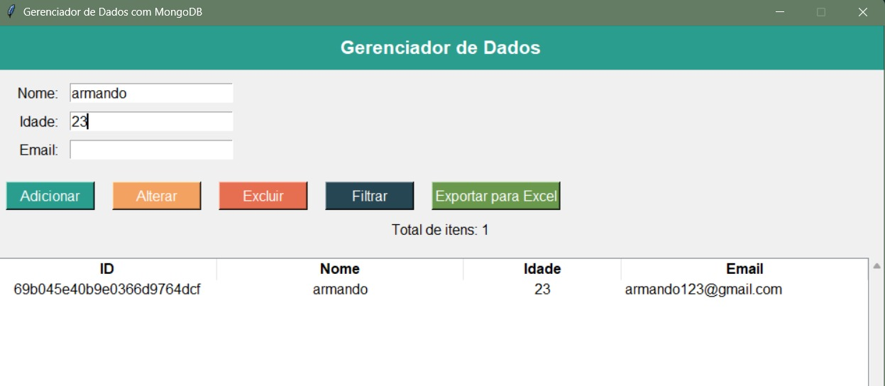
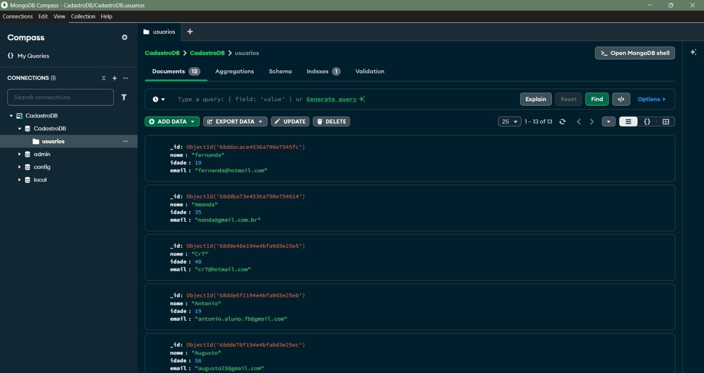

# 🗂 Gerenciador de Dados com MongoDB

Este projeto consiste em uma **aplicação desktop desenvolvida em Python** com interface gráfica em **Tkinter**, integrada ao **MongoDB**, permitindo realizar operações completas de gerenciamento de dados.

A aplicação permite cadastrar, visualizar, editar e excluir registros, além de realizar filtros e exportar dados para Excel, simulando um sistema real de gerenciamento de informações.

---

## 🎯 Objetivo do Projeto

O objetivo deste projeto é desenvolver uma aplicação prática que integre:

- Interface gráfica em Python
- Banco de dados NoSQL (MongoDB)
- Operações CRUD completas
- Manipulação e exportação de dados

O sistema simula um **gerenciador de cadastro de usuários**, permitindo manipular dados de forma visual e estruturada.

---

## ⚙️ Funcionalidades

A aplicação possui as seguintes funcionalidades:

### ➕ Cadastro de registros
Permite cadastrar novos usuários informando:

- Nome
- Idade
- Email

---

### ✏️ Alteração de registros
Permite atualizar informações de registros existentes.

---

### ❌ Exclusão de registros
Permite remover registros do banco de dados MongoDB.

---

### 🔎 Filtros de busca
Permite filtrar registros utilizando:

- Nome
- Idade
- Email

Utilizando consultas com **regex no MongoDB**.

---

### 📊 Visualização dos dados
Os registros são exibidos em uma **TreeView**, permitindo:

- visualização organizada
- seleção de registros
- atualização dinâmica da interface

---

### 📈 Contagem de registros
O sistema exibe dinamicamente o **total de registros cadastrados**.

---

### 📤 Exportação para Excel
Os dados exibidos na interface podem ser exportados para **arquivo Excel (.xlsx)** utilizando **Pandas**.

O arquivo é salvo com **timestamp automático** para evitar sobrescritas.

---
## 🖥 Interface da Aplicação

### Tela inicial do sistema

A aplicação permite visualizar todos os registros armazenados no banco de dados.


---

### Filtragem de dados

O sistema permite filtrar registros por **nome, idade ou email**, facilitando a busca por informações específicas.



---

## 🗄 Estrutura do Banco de Dados

O projeto utiliza **MongoDB** como banco de dados NoSQL para armazenar os registros.

A coleção utilizada é:

- **CadastroDB**
- **usuarios**

Visualização da coleção no MongoDB:



## 🛠 Tecnologias Utilizadas

- **Python**
- **Tkinter** – Interface gráfica
- **MongoDB** – Banco de dados NoSQL
- **PyMongo** – Conexão Python com MongoDB
- **Pandas** – Manipulação e exportação de dados
- **TreeView (ttk)** – Exibição tabular de dados

---

## 🏗 Arquitetura da Aplicação

A aplicação segue uma estrutura baseada em funções responsáveis por diferentes operações do sistema.

Principais componentes:

- Conexão com MongoDB
- Interface gráfica com Tkinter
- Operações CRUD no banco de dados
- Filtros de consulta
- Exportação de dados com Pandas

---

## ▶️ Como Executar o Projeto

### 1️⃣ Instalar dependências

```bash
pip install pymongo pandas openpyxl
```
### 2️⃣ Iniciar o MongoDB localmente

Certifique-se de que o serviço do MongoDB esteja em execução na sua máquina local.

Configuração utilizada no projeto:

```bash
mongodb://localhost:27017/
```
### 3️⃣ Executar o programa
```bash
python app.py
```
## 📖 Aprendizados

Durante o desenvolvimento deste projeto foram aplicados conceitos importantes como:

- Integração **Python + MongoDB**
- Operações **CRUD em banco NoSQL**
- Desenvolvimento de **interfaces gráficas com Tkinter**
- Manipulação de dados com **Pandas**
- Exportação de dados para **Excel**
- Validação de entrada de dados

---
## 👨‍💻 Autor
**Pedro Vasconcelos de Pinho**
Estudante de Ciência da Computação
